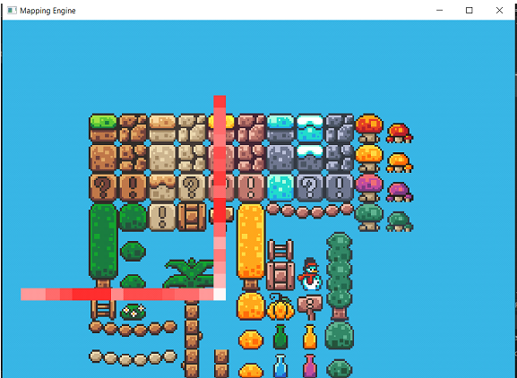
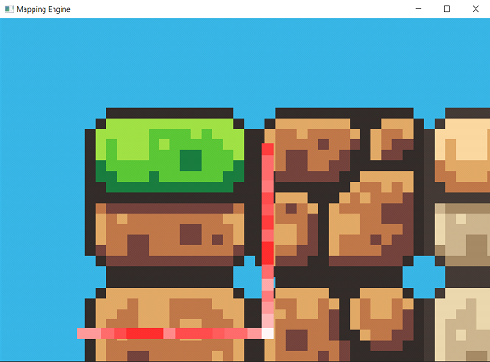
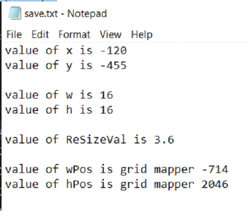
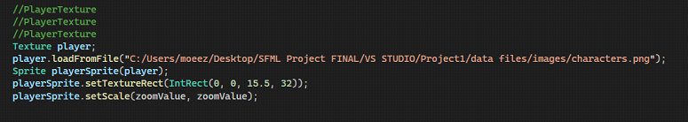

# Workings Sprite Mapping Engine

   

This is not the part of the main game directly . It is a tool that 
extracts the information that is then plugged into the SFML fucntion
that slices the Sprite Sheet.

 
This program is used to split individual images from a single tileset .png image file 
 

   

 

## Output of the Mapping Tool 
These images are cropped from the .txt file form the mapping tool , here this program outputs the upper x and y 
And lower x and y coordinated to a save.txt file  upon hitting the space key . 
 

   

 
The highlighted 4 values are then used as a parameter input that goes in the object of Sprite class , that is inherited in the main and inside the individual class of each image object . 
 

## Listener Fucntion

   

 
In the code above the Object of the ‘ Texture ’ class is using a ‘loadFromFile( )’ function to open the file . 
Then object of Sprite class , takes in the Object of ‘ Texture ‘ class as input .
Then object of sprite class takes in the 4 values from the save.txt file
As inputs for the ‘setTextureRect( )’ function.

