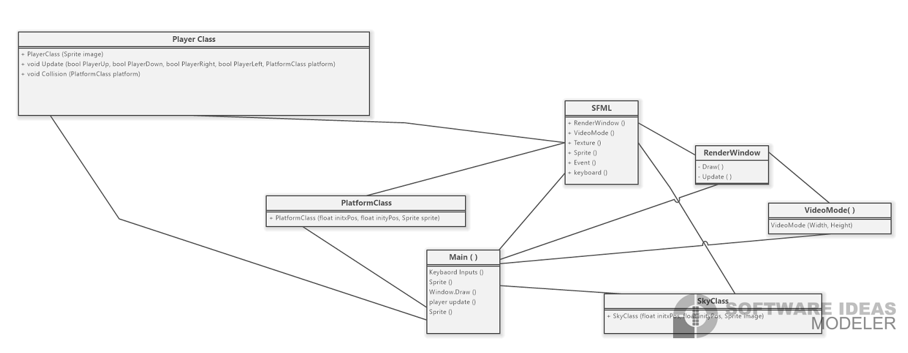
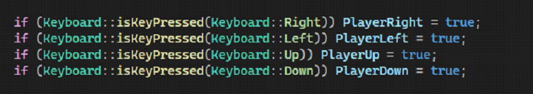
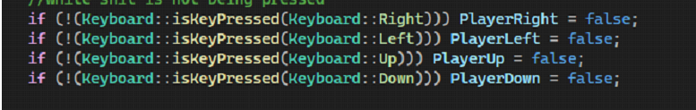
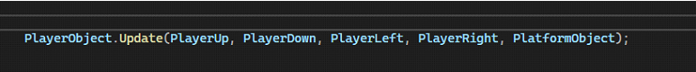
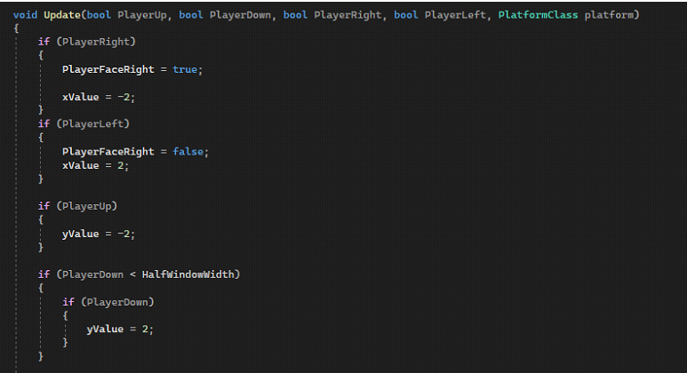
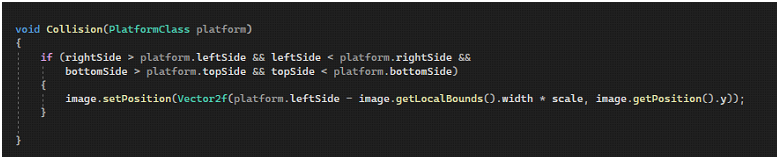

# Workings of the Mario Clone

   

 

## UML Diagram Of the Project
 

   

 

## Selecting and Setting up Graphics for the project :
I have use the SFML (Simple and Fast Multi-media Library) . The reason for selection was its emphasis on OOP concepts and the configurable DLL (dynamically linked libraries) .

Setting it up was a
hastle but overall it was rewarding . 

 

The character and the graphics are rendered 

 

## Taking inputs from Keyboard
To do that I used a build-in class from the SFML , the class KEYBOARD 
Takes in a bool  ‘IS PRESSED’  with is triggered by another instance of the KEYBOARD class that takes a bool that takes in a defined key from the keyboard as a parameter . 

   

Similar when applied with negation changes the values of bool that updates the player state .

   

 

## Mapping keys to controls to objects 
The main function has the Event class objects that is inside the object of RenderWindow class object .

This object takes in the input states On/Off  and passes that to the ‘PlayerClass’
It has Update function that takes in the bool function .
And  
Ingerited object from the PlatformClass 

   

   

 

## Object to Object Collison Function 
The PlatformClass is inhterited to the PlayerClass , so that  PlayerObject iamge can access the coordinates of the platform image objects .

   

