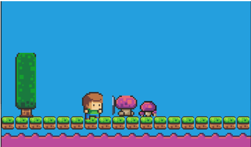
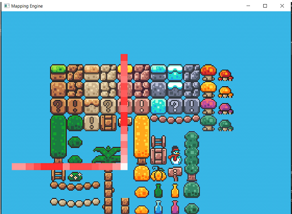
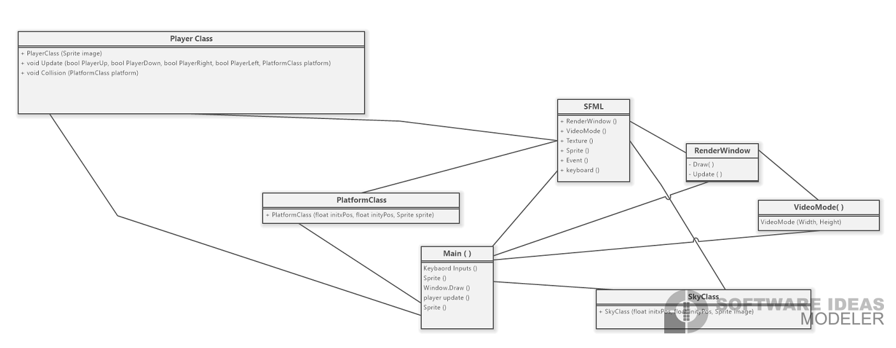
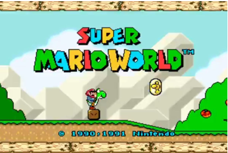

# Mario Clone and Spritesheet Mapping Engine

This project is coded in C++ and makes the use of the SFML 
library.

<!-- sample images of the project -->

  
   

## Authors

- [@moezmustafa](https://www.github.com/moezmustafa)🚀

## Badges

## Problems I Solved 
-	Selecting and Setting up Graphics for the project
-	Taking input from keyboard 
-	Mapping keys to control object
-	Objects collision
-	Gravity Physics 
-	Rendering Cropped images from a Tile Set .
-	Controlled , Mapping and Drawing Graphic Objects .

## How it works 

 I have use the SFML (Simple and Fast Multi-media Library) . The reason for selection was its emphasis on OOP concepts and the configurable DLL (dynamically linked libraries) .

 

  

  

<!-- 
# Super Mario Clone & Sprite-Sheet Mapper

A clone of the classic SNES game , coded in C++ , written in OOP
whilst using the SFML library to render graphics . 

## Controls 
### For Mario Clone
* Move: Left/Right/Down
* Crouch: Down
* Jump: Z

### For Sprite-Sheet Mapper
*  Move Sprite-Sheet -> Up/Down/Left/Right
*  Move the Red-Slicer -> W(up)/S(down)/A(left)/D(right)
*  Zooming Sprite-Sheet  ->  Z(zoom in) / X(zoom out)

## Screenshots

Original Game 

  

My Clone 

  

## Authors

- [@moezmustafa](https://www.github.com/moezmustafa) -->
